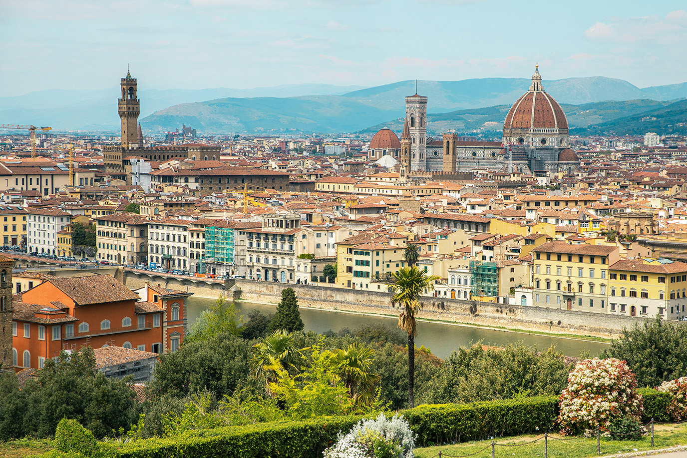
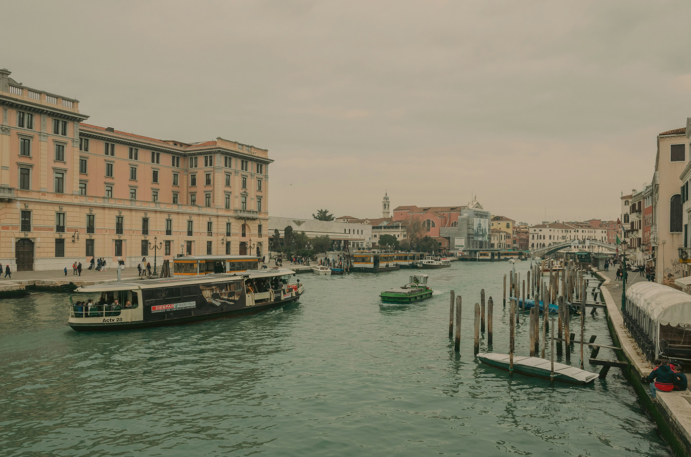
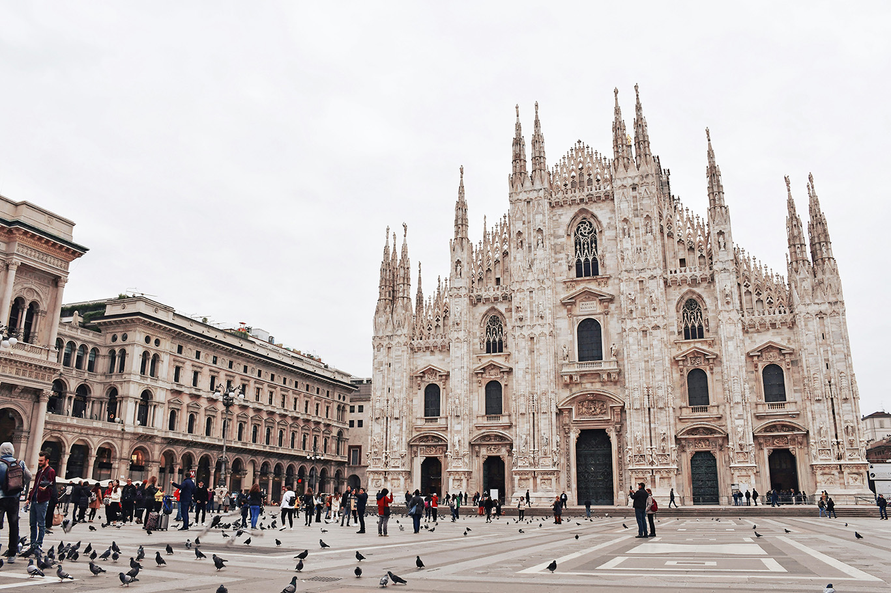

Italy is located in Southern Europe, extending into the Mediterranean Sea in a distinctive boot-shaped peninsula. It shares borders with countries such as France, Switzerland, Austria, and Slovenia, and also surrounds two independent states: Vatican City and San Marino. Italy has a population of around 59 million people, making it one of the most populous countries in Europe. Its capital city, Rome, is not only the political center but also a historic hub that has influenced Western civilization for centuries. The country features a diverse landscape that includes the Alps in the north, rolling countryside in central regions, and stunning coastlines along both the Adriatic and Tyrrhenian Seas.

The official language of Italy is Italian, though many regions have their own dialects and languages influenced by local history. The country uses the euro (€) as its official currency, making it convenient for travel within the Eurozone. Italy operates as a parliamentary republic with a rich cultural heritage shaped by art, architecture, and cuisine. It is globally renowned for contributions to fashion, design, and gastronomy, with cities like Milan leading in modern industry and innovation. With a high standard of living, strong tourism sector, and deep-rooted traditions, Italy remains one of the most influential and attractive countries in the world.

<AviasalesWidget src="https://tpscr.com/content?currency=usd&trs=401311&shmarker=314807&lat=41.8905198&lng=12.4942486&powered_by=true&search_host=www.aviasales.com%2Fsearch&locale=en&origin=ROM&value_min=0&value_max=1000&round_trip=true&only_direct=false&radius=1&draggable=true&disable_zoom=false&show_logo=false&scrollwheel=false&primary=%233FABDB&secondary=%23FFFFFF&light=%23FFFFFF&width=960&height=500&zoom=2&promo_id=4054&campaign_id=100" />

## Why Visit Italy?

Italy doesn’t just sit on a map; it lives in the imagination. As one of the world’s most beloved destinations, it offers an intoxicating blend of the ancient and the avant-garde.

### The Italian Allure

* **A Living Museum:** Walk through millennia of history, from the Colosseum’s Roman echoes to the Renaissance masterpieces of Florence. Italy holds more UNESCO World Heritage Sites than any other country.

* **he Culinary Gold Standard:** Experience the "slow food" movement at its source. Whether it’s a wood-fired Neapolitan pizza, authentic carbonara, or a simple scoop of artisanal gelato, every meal is a celebration.

* **Architectural Icons:** Stand beneath the Sistine Chapel ceiling or gaze up at the Leaning Tower of Pisa. The country is a blueprint of human ingenuity.

* **Topography of Contrast:** One day you’re hiking the jagged peaks of the Dolomites; the next, you’re sipping limoncello on the sun-drenched cliffs of the Amalfi Coast.

* **The High-Life Heritage:** Immerse yourself in a culture that defines global fashion, opera, and automotive design.

* From ancient civilizations to modern luxury, Italy is a destination that never disappoints.

**The Verdict:** Italy isn't just a place you visit; it’s a place you feel. From the rustic charm of a Tuscan vineyard to the high-octane energy of Milan, it remains the ultimate destination for those seeking the dolce vita.

## Top Cities to Explore

### Rome – The Eternal City

Rome is a living museum filled with historical treasures. Must-see attractions include:

* Colosseum
* Vatican City
* Trevi Fountain

Walking through Rome feels like stepping back in time, with ancient ruins and Renaissance art at every corner.

### Florence – The Cradle of Renaissance

Florence serves as a sanctuary for art enthusiasts, where the legacy of masters like Leonardo da Vinci and Michelangelo is etched into the very fabric of the city. This historic capital isn't just a place where art is kept; it is the birthplace of a movement that redefined human creativity, offering an immersive journey through some of the most influential masterpieces ever conceived.

The city’s skyline is dominated by the architectural grandeur of the Florence Cathedral, while the nearby Uffizi Gallery houses a world-class collection of Italian treasures. From the medieval charm of the gold-lined Ponte Vecchio to the storied halls of its many museums, Florence remains an essential pilgrimage for anyone looking to witness the pinnacle of Western artistic achievement.

### Venice – The Floating City

Venice stands as one of the most extraordinary cities on the planet, a floating masterpiece built across a labyrinth of canals rather than traditional roads. This aquatic marvel offers an atmosphere unlike anywhere else, where the rhythmic sound of water replaces the hum of traffic. For those seeking the city's true essence, the experience is especially magical at sunrise or sunset, when the daytime crowds dissipate and the soft light reflects off the historic facades in a shimmering display of gold and pink.

The heart of the Venetian experience lies in its storied landmarks and timeless traditions, from drifting through scenic waterways on an iconic gondola ride to standing in awe of the golden mosaics within St. Mark’s Basilica. A visit to the Doge’s Palace further reveals the city's past as a powerful maritime republic, showcasing grand chambers and intricate Gothic architecture. Whether you are getting lost in its narrow alleys or crossing its historic bridges, Venice remains a testament to human ingenuity and romantic charm.

### Milan – Fashion & Modern Italy

Milan stands as Italy’s sleek powerhouse, seamlessly blending its status as a global financial engine with its reputation as the world’s fashion capital. It is a city where cutting-edge contemporary culture meets deep-rooted history, making it the premier destination for those who thrive on high-end shopping and a sophisticated nightlife scene. Whether you're navigating the boardroom or the catwalk, Milan exudes a polished energy that is uniquely its own.

Beyond the glamour, the city houses architectural and artistic wonders that are truly unmissable. You can marvel at the intricate Gothic spires of the Milan Cathedral (the Duomo) before strolling through the glass-vaulted elegance of the Galleria Vittorio Emanuele II. For a more profound experience, no visit is complete without viewing Da Vinci’s The Last Supper, a masterpiece that anchors Milan’s rich cultural heritage amidst its modern-day hustle.

## Stunning Regions and Landscapes

### Tuscany – Rolling Hills & Vineyards

Tuscany is known for its picturesque countryside, charming villages, and world-class wines.

Popular spots:

* Siena
* Pisa
* Leaning Tower of Pisa

---

### Amalfi Coast – Coastal Beauty

The Amalfi Coast is famous for dramatic cliffs, colorful villages, and crystal-clear waters.

Top towns:

* Positano
* Amalfi

Ideal for relaxation, photography, and luxury travel.

---

### Lake Como – Luxury & Scenery

A favorite retreat for celebrities, Lake Como offers:

* Stunning lake views
* Elegant villas
* Peaceful atmosphere

---

## Italian Cuisine You Must Try

Italian food is one of the highlights of any trip.

Must-try dishes:

* **Pizza** from Naples
* **Pasta** (Carbonara, Bolognese, Pesto)
* **Gelato** – richer and creamier than regular ice cream
* **Risotto** – especially in northern Italy
* **Tiramisu** – classic Italian dessert

Each region has its own specialties, making food exploration a journey in itself.

---

## Best Time to Visit Italy

The best time to visit depends on your travel style:

* **Spring (April–June):** Mild weather, fewer crowds
* **Summer (July–August):** Peak season, great for beaches
* **Autumn (September–October):** Harvest season, ideal for wine lovers
* **Winter (November–March):** Fewer tourists, great for cities and skiing

---

## Travel Tips for Visiting Italy

Here are essential tips to make your trip smooth:

### 1. Learn Basic Italian Phrases

While many Italians speak English, simple phrases like *“Grazie”* and *“Ciao”* go a long way.

### 2. Use Public Transport

Italy has an excellent train network connecting major cities quickly and affordably.

### 3. Book Attractions in Advance

Popular sites like the Colosseum sell out fast.

### 4. Dress Modestly in Churches

When visiting places like Vatican City, ensure shoulders and knees are covered.

### 5. Beware of Tourist Traps

Avoid restaurants near major attractions; instead, explore local neighborhoods for authentic experiences.

---

## Hidden Gems in Italy

If you want to explore beyond the popular cities, consider:

* Matera – Unique stone dwellings
* Cinque Terre – Colorful cliffside towns
* Bologna – Authentic cuisine without heavy crowds

---

## Sample 7-Day Italy Itinerary

**Day 1–2:** Explore Rome
**Day 3:** Visit Florence
**Day 4:** Day trip to Pisa
**Day 5–6:** Discover Venice
**Day 7:** End in Milan

---

## Final Thoughts

Italy is more than just a destination—it’s an experience that captivates your senses. Whether you're exploring ancient ruins in Rome, sipping wine in Tuscany, or cruising the canals of Venice, every moment in Italy feels special.

With its perfect mix of history, culture, food, and scenery, Italy remains one of the most rewarding travel destinations in the world. Start planning your journey today and prepare to fall in love with everything Italy has to offer. 🇮🇹✨
